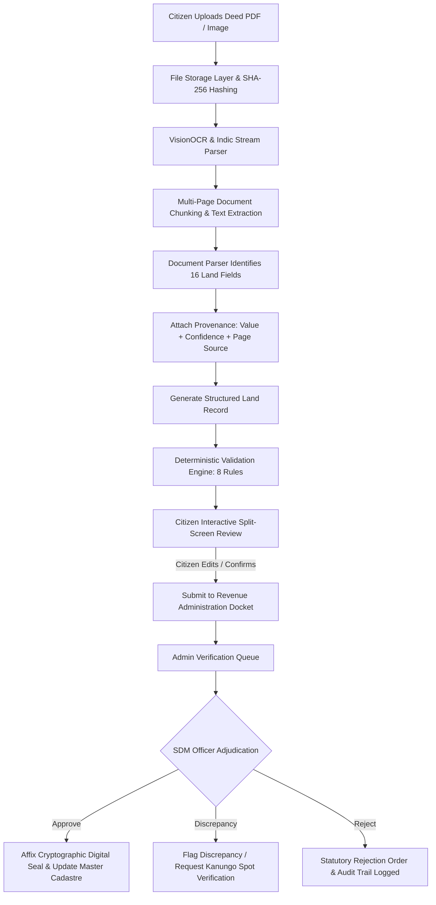
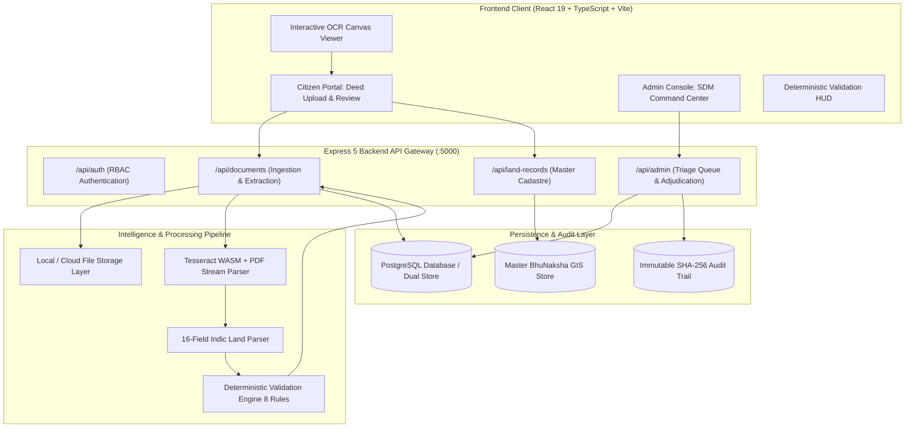
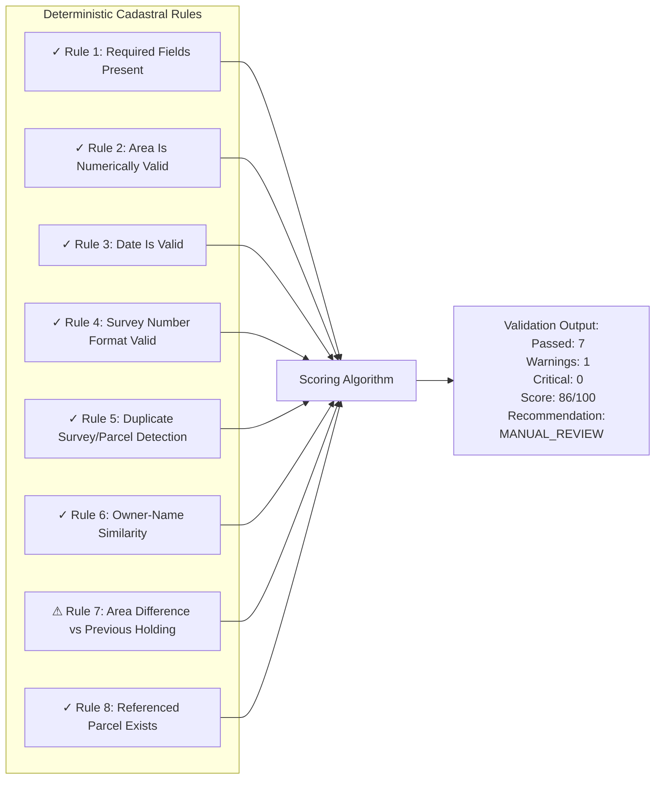

<div align="center">

# 🏛️ BhoomiLens (भूमिलेन्स)
### Intelligent Land Record Digitalization, Cadastral GIS Verification & Statutory Titling Engine
**Smart India Hackathon (SIH26018) • Digital India Land Records Modernization Programme (DILRMP)**

[](https://github.com/Rishisharma029/bhoomilens/actions/workflows/deploy.yml)
[](https://www.typescriptlang.org/)
[](https://react.dev/)
[](https://vitejs.dev/)
[](https://tailwindcss.com/)
[](https://opensource.org/licenses/MIT)
[](https://rishisharma029.github.io/bhoomilens/)

---

<p align="center">
  <b>BhoomiLens</b> is an enterprise-grade, AI-assisted land deed ingestion, Indic OCR clause extraction, deterministic cadastral validation, and executive adjudication platform engineered for State Revenue Authorities (State of Uttarakhand / Dev Bhoomi).
</p>

[Explore Live Demo](https://rishisharma029.github.io/bhoomilens/) • [Report Bug](https://github.com/Rishisharma029/bhoomilens/issues) • [Request Feature](https://github.com/Rishisharma029/bhoomilens/issues)

</div>

---

## 📑 Table of Contents
- [Executive Overview](#-executive-overview)
- [Key Features](#-key-features)
- [End-to-End Pipeline Workflow](#-end-to-end-pipeline-workflow)
- [System Architecture](#-system-architecture)
- [16-Field Schema with Provenance](#-16-field-schema-with-provenance)
- [Deterministic Validation Engine (8 Rules)](#-deterministic-validation-engine-8-rules)
- [Two Powerful Portals](#-two-powerful-portals)
- [RESTful API Specifications](#-restful-api-specifications)
- [Tech Stack](#-tech-stack)
- [Getting Started & Local Setup](#-getting-started--local-setup)
- [Deployment & GitHub Pages](#-deployment--github-pages)
- [License & Community](#-license--community)

---

## 🌟 Executive Overview

Land titling disputes in India tie up over **₹1.3 lakh crore ($16B)** across judicial courts, predominantly caused by:
1. **Asymmetric Legalese**: Citizens lack visibility into why an algorithmic engine trusts or questions an extracted deed clause.
2. **Disjointed Registries**: Deed registration at the Sub-Registrar Office (SRO) and Jamabandi / Khatauni mutations at the Tehsil operate in silos.
3. **Cadastral Boundary Overlaps**: Undetected discrepancies between physical deed descriptions and BhuNaksha GIS polygons.

**BhoomiLens bridges this gap** by combining:
- **Optical Indic Deed OCR** parsing bilingual Hindi/Devanagari legalese and English clauses.
- **Explainable Provenance**: Every extracted field carries its exact physical source (`source: "page 2"`), confidence score, and bounding box.
- **Pre-LLM Deterministic Validation Engine**: 8 mathematical, calendar, and cadastral rules executing before any probabilistic model is consulted.
- **Executive Revenue Console**: Dedicated triage queues, conflict centers, and statutory digital sealing (`0xUK_GOV_SEAL_...`) for Sub-Divisional Magistrates (SDMs) and Tehsildars.

---

## 🚀 Key Features

- **Multi-Format Ingestion**: Scanned deeds, digital PDFs, TIFFs, PNGs, and camera photos stored with SHA-256 tamper-proof file hashing.
- **16-Field Structured Land Record Schema**: Extracts Owner, Guardian, Khasra, Khata, Area, Unit, Village, Tehsil, District, State, Reg No, Reg Date, Deed Type, Previous Owner, Transaction Nature, and Four Cadastral Boundaries.
- **Field-Level Provenance & Trust Rationale**: Every field displays its exact page source and optical confidence badge, eliminating black-box AI opacity.
- **Split-Screen Interactive Review**: Synchronized preview linking extracted form fields with bounding-box highlights on original documents.
- **Deterministic Validation Engine**: 8 mathematical and legal rules returning explicit score (`86/100`), passed count (`7/8`), warnings, and recommendations (`MANUAL_REVIEW`).
- **Conflict Center**: Proactive detection of overlapping cadastral coordinates, dual-claim deeds within 60-day windows, and encumbrances.
- **Statutory Cryptographic Sealing**: Generates unique, verifiable digital revenue seals on officer approval (`0xUK_GOV_SEAL_HEX`).
- **Immutable Blockchain-Style Audit Ledger**: Every citizen upload, SDM inspection, correction petition, and seal generation is logged with block hashes.

---

## 🔄 End-to-End Pipeline Workflow



---

## 🏛️ System Architecture



---

## 📊 16-Field Schema with Provenance

For every extracted attribute, BhoomiLens persists the value, optical confidence score, and precise page provenance:

```json
{
  "value": "2.35",
  "confidence": 0.96,
  "source": "page 2"
}
```

| # | Field Label | Extracted Field Key | Example Value | Confidence | Provenance Source |
|---|---|---|---|:---:|:---:|
| 1 | **Owner Name** | `ownerName` | `Rishi Sharma` | 98% | `page 1` |
| 2 | **Father / Guardian Name** | `fatherName` | `Late Bipin Chandra Sharma` | 96% | `page 1` |
| 3 | **Survey / Khasra Number** | `surveyNo` | `124/7` | 99% | `page 2` |
| 4 | **Khata / Account Number** | `khataNo` | `0042` | 95% | `page 2` |
| 5 | **Area** | `area` | `2.35` | 96% | `page 2` |
| 6 | **Unit** | `unit` | `Acres` | 98% | `page 2` |
| 7 | **Village** | `village` | `ABC` | 97% | `page 2` |
| 8 | **Tehsil** | `tehsil` | `Central Tehsil` | 95% | `page 1` |
| 9 | **District** | `district` | `XYZ` | 98% | `page 1` |
| 10 | **State** | `state` | `Uttarakhand` | 99% | `page 1` |
| 11 | **Registration Number** | `registrationNumber` | `UK-XYZ-2019-REG-04821` | 99% | `page 1` |
| 12 | **Registration Date** | `registrationDate` | `14/08/2019` | 99% | `page 1` |
| 13 | **Document Type** | `documentType` | `Registered Absolute Conveyance Deed` | 97% | `page 1` |
| 14 | **Previous Owner** | `previousOwner` | `Ram Gopal Sharma` | 95% | `page 1` |
| 15 | **Transaction Type** | `transactionType` | `Absolute Sale & Conveyance with Possession` | 96% | `page 1` |
| 16 | **Four Boundaries** | `boundaries` | `North: 124/6 \| South: Canal \| East: Road \| West: 124/8` | 93% | `page 2` |

---

## ⚡ Deterministic Validation Engine (8 Rules)

Before any LLM reasoning, BhoomiLens runs **8 deterministic rules** across mathematical, temporal, spatial, and cadastral constraints:



### Validation Result Object Contract
```json
{
  "passed": 7,
  "warnings": 1,
  "critical": 0,
  "score": 86,
  "recommendation": "MANUAL_REVIEW",
  "rules": [
    {
      "id": "rule_required_fields",
      "name": "Required field present",
      "category": "COMPLETENESS",
      "status": "PASS",
      "symbol": "✓",
      "score": 100,
      "detail": "All 6 mandatory cadastral fields present."
    },
    {
      "id": "rule_area_numeric",
      "name": "Area is numerically valid",
      "category": "METRIC",
      "status": "PASS",
      "symbol": "✓",
      "score": 100,
      "detail": "Area '2.35' parsed as 2.35 numeric acres within valid thresholds."
    },
    {
      "id": "rule_area_difference",
      "name": "Area difference against previous record",
      "category": "METRIC",
      "status": "WARNING",
      "symbol": "⚠",
      "score": 75,
      "detail": "Area differs from the previous registered record by 0.75 acres. Supporting documentation should be reviewed."
    }
  ]
}
```

---

## 👥 Two Powerful Portals

### 1. 👨‍🌾 Citizen Portal
- **Dashboard Telemetry**: Active landholdings, mutation statuses, tax challans, and pending applications.
- **Deed Ingestion**: Drag-and-drop deed uploads with instant OCR feedback and preloaded sample deeds.
- **Split-Screen Review**: Side-by-side verification comparing original document bounding boxes against extracted values.
- **Inline Rectification**: Edit any field with citizen-verified attribution before submitting to the Tehsildar.
- **Rectification Petitions**: File formal correction requests with documentary proof.

### 2. 🏛️ Revenue Admin Console (SDM / Tehsildar)
- **Executive Jurisdiction Dashboard**: Real-time telemetry (24,581 Land Records, 1,243 Pending Verifications, 287 Conflicts, 164 Corrections, 21,904 Processed Documents).
- **Verification Queue**: Triage table displaying AI trust scores, survey numbers, applicant details, and status badges.
- **Three-Panel Review**: Synchronized inspection view showing Original Deed, Extracted Structured Record, and Validation Engine results.
- **Statutory Adjudication**: One-click Approve, Reject, or Request Correction with custom condition precedents.
- **Cryptographic Seal Generation**: Affixes official digital stamps (`0xUK_GOV_SEAL_...`) synced across document and land record databases.
- **Conflict Center**: Real-time alerts for boundary polygon overlaps, stay orders, and dual registration attempts.
- **Immutable Audit Trail**: Chronological, cryptographically hashed event ledger for legal forensics.

---

## 🔌 RESTful API Specifications

| Method | Endpoint | Description |
|---|---|---|
| `GET` | `/api/health` | Service health, version, and node heartbeat |
| `POST` | `/api/auth/login` | Role-based authentication (Citizen & Admin SDM) |
| `GET` | `/api/land-records` | Fetch master cadastral parcels (with owner/khasra filters) |
| `GET` | `/api/land-records/:id` | Retrieve single cadastral parcel record |
| `POST` | `/api/documents/upload` | **Full Ingestion**: File storage, OCR, 16-field parser & validation |
| `GET` | `/api/documents/:id` | Fetch document submission details and extracted fields |
| `PUT` | `/api/documents/:id` | Update citizen inline edits with provenance flags |
| `POST` | `/api/documents/:id/submit` | Submit document to official SDM verification queue |
| `GET` | `/api/admin/stats` | Retrieve Admin dashboard jurisdiction telemetry |
| `GET` | `/api/admin/verification-queue` | Fetch verification triage queue items |
| `GET` | `/api/admin/records/:id/validate` | Execute 8 deterministic validation rules on parcel |
| `POST` | `/api/admin/records/:id/adjudicate` | Unified officer adjudication (`APPROVE` / `REJECT` / `REQUEST_CORRECTION`) |
| `POST` | `/api/admin/records/:id/approve` | Shortcut endpoint for official verification & seal affixation |
| `POST` | `/api/admin/records/:id/reject` | Reject application with documentary rationale |
| `POST` | `/api/admin/records/:id/request-correction` | Flag discrepancy and request Kanungo spot inspection |
| `GET` | `/api/admin/conflicts` | List detected cadastral overlaps and registration conflicts |
| `GET` | `/api/admin/correction-requests` | List citizen rectification petitions |
| `POST` | `/api/admin/correction-requests/:id/adjudicate` | Resolve rectification request with automated record update |
| `GET` | `/api/admin/audit-logs` | Retrieve immutable cryptographic audit ledger |
| `GET` | `/api/admin/users` | List registered departmental officers and citizens |

---

## 🛠️ Tech Stack

| Domain | Technologies |
|---|---|
| **Frontend UI** | React 19, TypeScript, Vite 8, Tailwind CSS, Lucide React |
| **Routing & Navigation** | React Router DOM v7 (SPA with GitHub Pages 404 fallback) |
| **Backend & API** | Node.js 20+, Express 5, Multer, CORS |
| **OCR & Vision** | Tesseract.js (WASM Vision Engine), PDF-Parse, Indic regex parsers |
| **Storage & Persistence**| Dual-Mode PostgreSQL (`pg`) with automatic local JSON fallback |
| **Integrity & Security** | SHA-256 Document Hashing, Cryptographic Statutory Digital Sealing |
| **DevOps & CI/CD** | GitHub Actions (`deploy-pages@v4`), Concurrently, TSX |

---

## 💻 Getting Started & Local Setup

### Prerequisites
- [Node.js](https://nodejs.org/) (v18.0 or higher recommended)
- [npm](https://www.npmjs.com/) (v9.0 or higher)

### 1. Clone the Repository
```bash
git clone https://github.com/Rishisharma029/bhoomilens.git
cd bhoomilens
```

### 2. Install Dependencies
```bash
npm install
```

### 3. Run Development Servers
```bash
# Run both Frontend (:5173) and Backend (:5000) simultaneously:
npm run dev:all
```
*Or run them in separate terminals:*
```bash
# Terminal 1: Backend Express API
npm run server

# Terminal 2: Frontend Vite Dev Server
npm run dev
```

### 4. Verify TypeScript Compilation & Build
```bash
npm run build
```

### 5. Run Automated Pipeline Test Suite
```bash
# Tests End-to-End OCR, 16-Field Extraction, Validation, and Admin Queue:
npx tsx server/test_ocr_pipeline.ts

# Tests Backend Admin & Verification API routes:
npx tsx server/test_api.ts
```

---

## 🌐 Deployment & GitHub Pages

BhoomiLens is configured for continuous deployment to **GitHub Pages** via GitHub Actions:
- **Workflow**: [`.github/workflows/deploy.yml`](.github/workflows/deploy.yml)
- **Base Path**: Configured with relative resolution in [`vite.config.ts`](vite.config.ts).
- **SPA Fallback**: Automatically creates `dist/404.html` on build to support direct client-side routing on GitHub Pages without 404 errors.
- **Live URL**: `https://rishisharma029.github.io/bhoomilens/`

To trigger deployment:
```bash
git push origin main
```
The GitHub Action will automatically build and publish the live production bundle!

---

## 📜 License & Community

- **License**: Released under the [MIT License](LICENSE).
- **Code of Conduct**: Adheres to the [Contributor Covenant v2.1](CODE_OF_CONDUCT.md).
- **Contributions**: Review [CONTRIBUTING.md](CONTRIBUTING.md) to contribute patches, bug fixes, or enhancements.

---

<div align="center">
  <b>BhoomiLens (भूमिलेन्स)</b> • Built with ❤️ for Smart India Hackathon & DILRMP 🇮🇳
</div>
